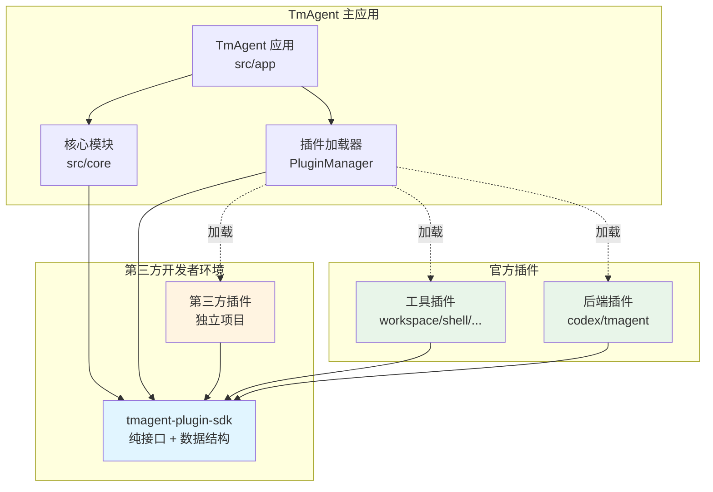
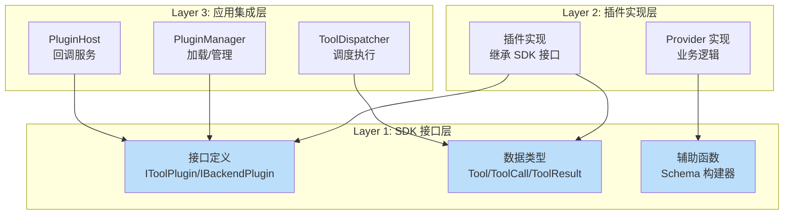
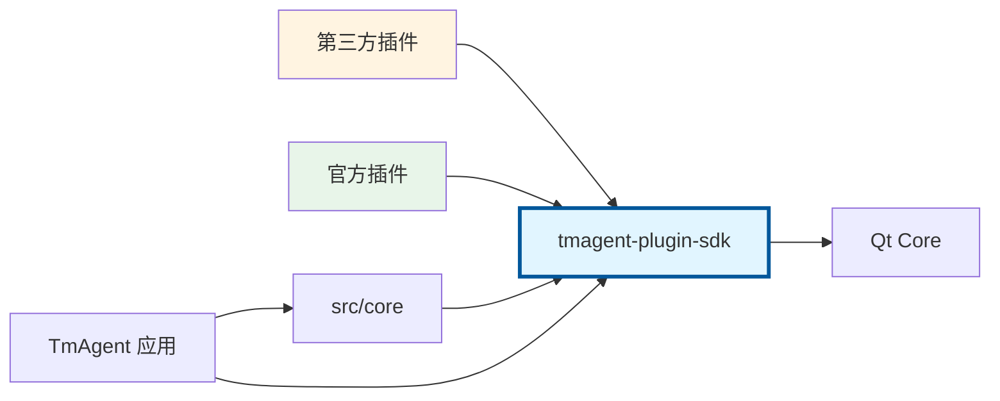
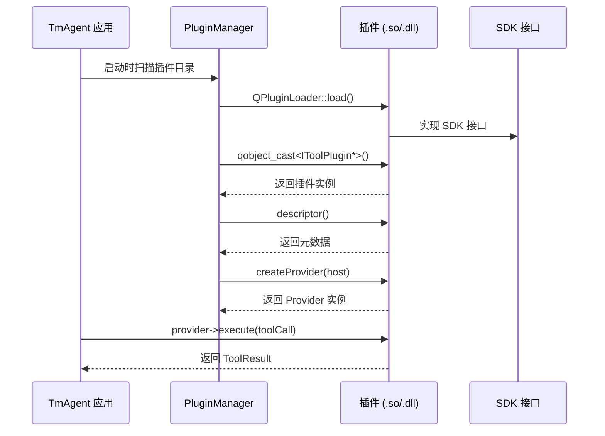
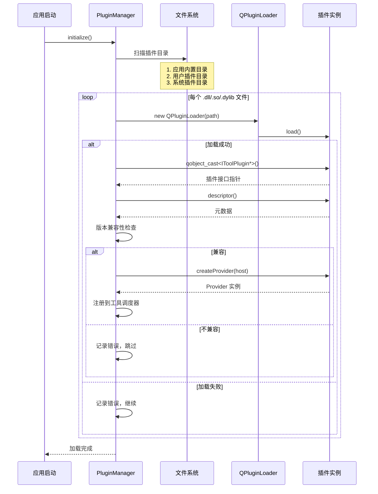
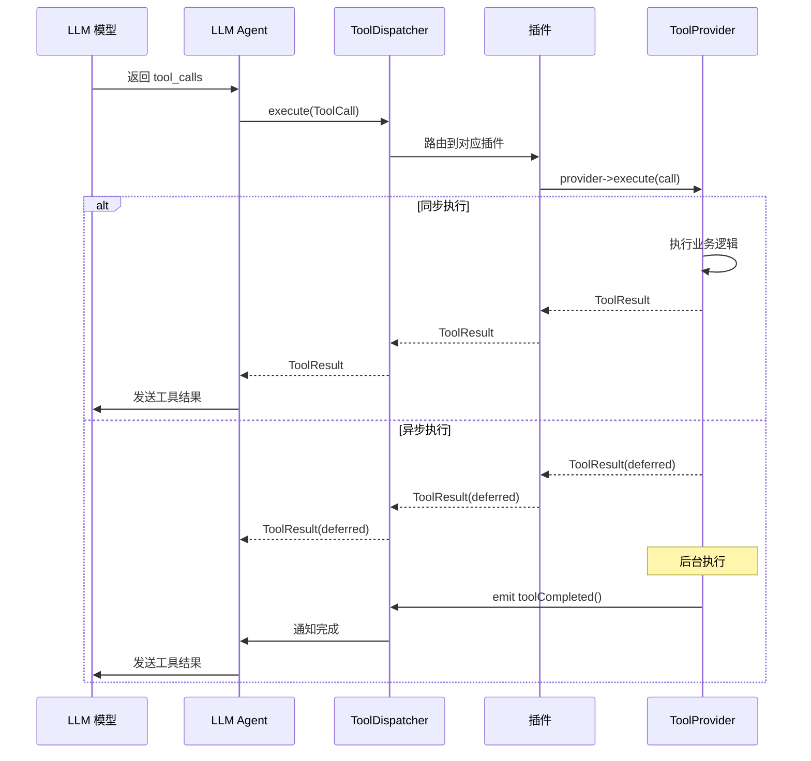

# 设计文档：TmAgent 插件 SDK 架构重构

## 概述

本设计旨在将 TmAgent 的插件系统从紧耦合的内部模块重构为独立的 SDK 架构。当前插件强依赖 `src/core/` 的内部实现，无法独立编译和分发。重构后，第三方开发者可以仅依赖轻量级 SDK（< 100KB）开发插件，无需克隆整个项目。SDK 将提供纯接口定义、POD 数据结构和辅助工具函数，最小化依赖（仅 Qt Core），确保 ABI 稳定性和跨平台兼容性（Qt 5.x/6.x，Windows/Linux/macOS）。

## 架构

### 整体架构图



### 分层架构




## SDK 项目结构

### 目录组织

```
tmagent-plugin-sdk/
├── include/
│   ├── tmagent/
│   │   ├── plugin/
│   │   │   ├── IToolPlugin.h           # 工具插件接口
│   │   │   ├── IToolProvider.h         # 工具提供者接口
│   │   │   ├── IToolPluginHost.h       # 宿主回调接口
│   │   │   ├── IBackendPlugin.h        # 后端插件接口
│   │   │   ├── IDelegateBackend.h      # 委托后端接口
│   │   │   └── ITeammateBackend.h      # 队友后端接口
│   │   ├── types/
│   │   │   ├── ToolTypes.h             # 工具数据结构
│   │   │   ├── PluginTypes.h           # 插件元数据结构
│   │   │   ├── BackendTypes.h          # 后端数据结构
│   │   │   └── CommonTypes.h           # 通用类型定义
│   │   ├── support/
│   │   │   ├── ToolSchemaBuilder.h     # Schema 构建辅助
│   │   │   └── PluginMacros.h          # 插件宏定义
│   │   └── version.h                   # SDK 版本信息
├── examples/
│   ├── minimal-tool-plugin/            # 最小工具插件示例
│   └── minimal-backend-plugin/         # 最小后端插件示例
├── docs/
│   ├── API.md                          # API 参考文档
│   ├── MIGRATION.md                    # 迁移指南
│   └── TUTORIAL.md                     # 开发教程
├── CMakeLists.txt                      # CMake 构建配置
├── tmagent-plugin-sdk.pri              # qmake 构建配置
├── LICENSE
└── README.md
```

### 模块划分

**核心模块**：
- `plugin/` - 插件接口定义（工具插件、后端插件）
- `types/` - 数据结构定义（POD 类型，可序列化）
- `support/` - 辅助工具（inline 函数，无需链接）

**文档模块**：
- `examples/` - 可编译的示例项目
- `docs/` - 开发文档和迁移指南

## 接口分层架构

### Layer 1: SDK 接口层（tmagent-plugin-sdk）

**职责**：定义插件与主应用之间的契约

**组成**：
- 纯虚接口（abstract base classes）
- POD 数据结构（Plain Old Data）
- inline 辅助函数（无需链接）

**依赖**：仅依赖 Qt Core（QObject, QString, QJsonObject 等）

**ABI 稳定性保证**：
- 接口使用纯虚函数，不包含数据成员
- 数据结构使用 POD 类型，避免虚函数表
- 版本号遵循语义化版本（Semantic Versioning）
- 主版本号变更表示 ABI 不兼容

### Layer 2: 插件实现层（第三方/官方插件）

**职责**：实现具体的工具或后端逻辑

**组成**：
- 插件入口类（继承 IToolPlugin 或 IBackendPlugin）
- Provider 实现类（继承 IToolProvider 或 Backend 接口）
- 业务逻辑代码

**依赖**：
- tmagent-plugin-sdk（编译时）
- Qt Core/Network/其他模块（根据需要）
- 第三方库（可选）

**编译产物**：动态库（.dll / .so / .dylib）

### Layer 3: 应用集成层（TmAgent 主应用）

**职责**：加载、管理和调度插件

**组成**：
- PluginManager - 插件发现和加载
- ToolDispatcher - 工具调度执行
- BackendPluginManager - 后端管理
- PluginHost - 提供回调服务

**依赖**：
- tmagent-plugin-sdk（接口定义）
- src/core/（内部实现）


## 依赖关系图

### 编译时依赖



### 运行时依赖



### 关键依赖解耦点

| 当前依赖 | 类型 | 解耦方案 |
|---------|------|---------|
| `core/agent/ToolDispatcher.h` | 强耦合 | 通过 IToolPluginHost 回调接口访问 |
| `core/backend/BackendPluginManager.h` | 强耦合 | 插件无需直接访问，由应用层管理 |
| `core/parser/TreeSitterParser.h` | 强耦合 | 通过 IToolPluginHost 提供解析服务 |
| `core/logging/LogCatalog.h` | 强耦合 | 使用 Qt 标准日志（qDebug/qWarning） |
| `core/service/include/SchedulerService.h` | 强耦合 | 通过 IToolPluginHost 提供调度服务 |
| `core/agent/delegate/DelegateBackendSupport.h` | 工具函数 | 移入 SDK 的 support/ 模块 |
| `core/model/Teammate.h` | 数据模型 | 提取为 SDK 的 POD 结构 |
| `llm/LLMTypes.h` | 数据模型 | 提取必要部分到 SDK |

## 版本兼容策略

### 语义化版本控制

SDK 版本格式：`MAJOR.MINOR.PATCH`

- **MAJOR**：ABI 不兼容变更（接口签名变更、删除接口）
- **MINOR**：ABI 兼容的功能新增（新增接口方法、新增数据字段）
- **PATCH**：Bug 修复、文档更新

### ABI 稳定性保证

**接口设计原则**：
```cpp
// ✓ 正确：纯虚接口，无数据成员
class IToolProvider {
public:
    virtual ~IToolProvider() = default;
    virtual QList<Tool> listTools() const = 0;
    virtual ToolResult execute(const ToolCall& call) = 0;
};

// ✗ 错误：包含数据成员，破坏 ABI 稳定性
class IToolProvider {
    QString m_name; // 不要这样做！
public:
    virtual QList<Tool> listTools() const = 0;
};
```

**数据结构设计原则**：
```cpp
// ✓ 正确：POD 结构，字段只增不减
struct Tool {
    QString name;
    QString description;
    QJsonObject inputSchema;
    // 未来可以在末尾添加新字段
    // QString category;  // v1.1.0 新增
};

// ✗ 错误：包含虚函数，有虚函数表
struct Tool {
    virtual QString getName() const; // 不要这样做！
};
```

### 版本检查机制

```cpp
// SDK 版本宏定义
#define TMAGENT_SDK_VERSION_MAJOR 1
#define TMAGENT_SDK_VERSION_MINOR 0
#define TMAGENT_SDK_VERSION_PATCH 0
#define TMAGENT_SDK_VERSION_STRING "1.0.0"

// 插件声明兼容的 SDK 版本
struct ToolPluginDescriptor {
    QString pluginId;
    QString version;
    int sdkVersionMajor = TMAGENT_SDK_VERSION_MAJOR;
    int sdkVersionMinor = TMAGENT_SDK_VERSION_MINOR;
    // ...
};
```


**应用层版本检查**：
```cpp
bool PluginManager::isCompatible(const ToolPluginDescriptor& desc) const {
    // 主版本号必须匹配
    if (desc.sdkVersionMajor != TMAGENT_SDK_VERSION_MAJOR)
        return false;
    
    // 次版本号：插件可以使用旧版本 SDK（向前兼容）
    if (desc.sdkVersionMinor > TMAGENT_SDK_VERSION_MINOR)
        return false;
    
    return true;
}
```

### 向后兼容策略

**阶段 1（v1.0.0）**：
- 创建 SDK 项目，抽取核心接口
- 主应用同时支持旧路径（`src/core/agent/`）和新路径（SDK）
- 官方插件迁移到 SDK

**阶段 2（v1.1.0）**：
- 新增功能通过 SDK 扩展
- 旧接口标记为 deprecated
- 文档引导第三方开发者使用 SDK

**阶段 3（v2.0.0）**：
- 移除旧接口
- 完全基于 SDK 架构

## 插件加载机制

### 插件发现流程



### 插件搜索路径

**优先级顺序**：
1. 应用内置插件目录：`{APP_DIR}/plugins/`
2. 用户插件目录：`{USER_DATA}/TmAgent/plugins/`
3. 系统插件目录：`/usr/local/lib/tmagent/plugins/`（Linux/macOS）

**目录结构**：
```
plugins/
├── tools/
│   ├── shell/
│   │   ├── ShellToolsPlugin.dll
│   │   └── shell_tools.json
│   └── workspace/
│       ├── WorkspaceToolsPlugin.dll
│       └── workspace_tools.json
└── backends/
    ├── codex/
    │   ├── CodexBackendPlugin.dll
    │   └── codex_backend.json
    └── custom/
        ├── CustomBackendPlugin.dll
        └── custom_backend.json
```

### 插件元数据文件

**格式**：JSON 文件，与插件动态库同名

**示例**（`shell_tools.json`）：
```json
{
  "pluginId": "shell_tools",
  "displayName": "命令工具",
  "version": "1.0.0",
  "sdkVersion": "1.0.0",
  "category": "tools",
  "description": "命令执行与工作目录控制相关工具",
  "author": "TmAgent Team",
  "license": "MIT",
  "homepage": "https://github.com/tmagent/plugins/shell",
  "dependencies": {
    "qt": ">=5.15.0",
    "sdk": "^1.0.0"
  }
}
```


## 组件和接口

### 组件 1: SDK 核心接口

**目的**：定义插件系统的基础契约

**接口**：

#### IToolPlugin（工具插件接口）

```cpp
// include/tmagent/plugin/IToolPlugin.h
class IToolPlugin {
public:
    virtual ~IToolPlugin() = default;
    
    // 返回插件元数据
    virtual ToolPluginDescriptor descriptor() const = 0;
    
    // 创建工具提供者实例
    virtual IToolProvider* createProvider(IToolPluginHost* host, 
                                         QObject* parent) = 0;
    
    // 配置提供者（可选）
    virtual bool configureProvider(IToolProvider* provider,
                                  const QJsonObject& config,
                                  QString* error) { return true; }
    
    // 健康检查（可选）
    virtual ToolPluginHealth health(const IToolProvider* provider) const;
};

#define TMAGENT_TOOL_PLUGIN_IID "org.tmagent.ToolPlugin/1.0"
Q_DECLARE_INTERFACE(IToolPlugin, TMAGENT_TOOL_PLUGIN_IID)
```

#### IToolProvider（工具提供者接口）

```cpp
// include/tmagent/plugin/IToolProvider.h
class IToolProvider {
public:
    virtual ~IToolProvider() = default;
    
    // 列出所有可用工具
    virtual QList<Tool> listTools() const = 0;
    
    // 执行工具调用
    virtual ToolResult execute(const ToolCall& call) = 0;
};
```

#### IToolPluginHost（宿主回调接口）

```cpp
// include/tmagent/plugin/IToolPluginHost.h
class IToolPluginHost {
public:
    virtual ~IToolPluginHost() = default;
    
    // 查询可用的后端 ID 列表
    virtual QStringList availableTeammateBackendIds() const = 0;
    
    // 请求主应用执行工具（用于工具间调用）
    virtual ToolResult executeHostTool(const ToolCall& call) = 0;
    
    // 记录日志到主应用
    virtual void logMessage(const QString& pluginId,
                           const QString& level,
                           const QString& message) = 0;
    
    // 获取应用配置
    virtual QJsonObject getAppConfig(const QString& key) const = 0;
};
```

**职责**：
- 提供插件入口点（Qt 插件机制）
- 创建工具提供者实例
- 声明插件元数据
- 可选的配置和健康检查

### 组件 2: 后端插件接口

**目的**：支持可扩展的 AI 后端

**接口**：

#### IBackendPlugin（后端插件接口）

```cpp
// include/tmagent/plugin/IBackendPlugin.h
class IBackendPlugin {
public:
    virtual ~IBackendPlugin() = default;
    
    // 返回后端元数据
    virtual BackendDescriptor descriptor() const = 0;
    
    // 创建委托后端（用于子任务委托）
    virtual IDelegateBackend* createDelegateBackend(QObject* parent) = 0;
    
    // 创建队友后端（用于持久化协作）
    virtual ITeammateBackend* createTeammateBackend(QObject* parent) = 0;
};

#define TMAGENT_BACKEND_PLUGIN_IID "org.tmagent.BackendPlugin/1.0"
Q_DECLARE_INTERFACE(IBackendPlugin, TMAGENT_BACKEND_PLUGIN_IID)
```

#### IDelegateBackend（委托后端接口）

```cpp
// include/tmagent/plugin/IDelegateBackend.h
namespace TmAgent {

struct DelegateRequest {
    QString task;                    // 任务描述
    QString executionPrompt;         // 执行提示词
    AgentConfig childConfig;         // 子 Agent 配置
    int expectedTimeoutMs;           // 超时时间
    int maxResponseChars;            // 最大响应字符数
    bool restrictDelegation;         // 是否限制递归委托
    QStringList inheritedAllowedTools; // 继承的工具权限
};

struct DelegateCallbacks {
    std::function<void()> onActivity;
    std::function<void(const QString&)> onSummary;
    std::function<void(const ToolExecutionEvent&)> onToolEvent;
    std::function<void(const QString&)> onStreamDelta;
    std::function<void(const QString&)> onSuccess;
    std::function<void(const QString&)> onFailure;
};

class IDelegateSession {
public:
    virtual ~IDelegateSession() = default;
    virtual QString backendId() const = 0;
    virtual void start() = 0;
    virtual void cancel() = 0;
};

class IDelegateBackend {
public:
    virtual ~IDelegateBackend() = default;
    virtual QString backendId() const = 0;
    virtual std::unique_ptr<IDelegateSession> createSession(
        const DelegateRequest& request,
        const DelegateCallbacks& callbacks,
        QString* error) = 0;
};

} // namespace TmAgent
```


#### ITeammateBackend（队友后端接口）

```cpp
// include/tmagent/plugin/ITeammateBackend.h
namespace TmAgent {

struct TeammateConfig {
    QString name;
    QString role;
    QString backend;
    QString persistence;         // "persistent" | "temporary"
    QString workingDirectory;
    QString ownerAgentId;
    int turnIdleTimeoutMs;
    bool autoCleanup;
    QString ephemeralOwnerTurnId;
    QJsonObject backendOverrides;
};

struct TeammateState {
    QString id;
    QString threadId;
    QString activeTurnId;
    QString status;              // "idle" | "busy" | "error" | "shutdown"
    QString lastError;
    int turnCount;
    qint64 createdAtMs;
    qint64 lastActiveAtMs;
};

class ITeammateBackend {
public:
    virtual ~ITeammateBackend() = default;
    
    struct CreateResult {
        bool success;
        QString threadId;
        QString error;
    };
    
    struct SendResult {
        bool success;
        QString turnId;
        QString error;
    };
    
    virtual QString backendId() const = 0;
    virtual bool ensureReady(QString* error = nullptr) = 0;
    virtual bool isReady() const = 0;
    
    virtual CreateResult createSession(const QString& teammateId,
                                      const TeammateConfig& config) = 0;
    virtual SendResult sendMessage(const QString& teammateId,
                                  const QString& text) = 0;
    virtual bool cancelTurn(const QString& teammateId,
                           QString* error = nullptr) = 0;
    virtual void destroySession(const QString& teammateId) = 0;
    virtual void shutdown() = 0;
};

} // namespace TmAgent
```

**职责**：
- 定义后端插件的标准接口
- 支持委托后端和队友后端两种模式
- 提供会话管理和消息发送能力

### 组件 3: 数据模型

**目的**：定义插件与主应用之间的数据交换格式

**数据结构**：

#### Tool（工具定义）

```cpp
// include/tmagent/types/ToolTypes.h
struct Tool {
    QString name;
    QString description;
    QJsonObject inputSchema;  // JSON Schema 格式
    
    QJsonObject toJson() const {
        QJsonObject functionObj;
        functionObj["name"] = name;
        functionObj["description"] = description;
        functionObj["parameters"] = inputSchema;
        
        QJsonObject obj;
        obj["type"] = "function";
        obj["function"] = functionObj;
        return obj;
    }
};
```

#### ToolCall（工具调用请求）

```cpp
struct ToolCall {
    QString id;          // 调用 ID
    QString name;        // 工具名称
    QJsonObject input;   // 输入参数
    
    static ToolCall fromJson(const QJsonObject& json);
};
```

#### ToolResult（工具执行结果）

```cpp
struct ToolResult {
    QString rawContent;      // 给 LLM 的完整数据
    QString userSummary;     // 给用户的简短摘要
    bool success;            // 执行状态
    QJsonObject data;        // 结构化元数据
    
    ToolResult() : success(true) {}
    ToolResult(const QString& raw, const QString& summary, 
               bool ok = true, const QJsonObject& extraData = {})
        : rawContent(raw), userSummary(summary), 
          success(ok), data(extraData) {}
};
```

#### ToolPluginDescriptor（插件元数据）

```cpp
// include/tmagent/types/PluginTypes.h
struct ToolPluginDescriptor {
    QString pluginId;
    QString displayName;
    QString version;
    QString description;
    QString category;
    QStringList toolNames;
    QJsonObject configSchema;
    
    // SDK 版本兼容性
    int sdkVersionMajor;
    int sdkVersionMinor;
    
    bool isValid() const {
        return !pluginId.trimmed().isEmpty();
    }
};
```

#### BackendDescriptor（后端元数据）

```cpp
// include/tmagent/types/BackendTypes.h
struct BackendDescriptor {
    QString backendId;
    QString displayName;
    QString version;
    bool supportsDelegate;
    bool supportsTeammate;
    
    // SDK 版本兼容性
    int sdkVersionMajor;
    int sdkVersionMinor;
    
    bool isValid() const {
        return !backendId.trimmed().isEmpty() 
            && (supportsDelegate || supportsTeammate);
    }
};
```

**验证规则**：
- `pluginId` 和 `backendId` 必须非空
- 版本号必须符合语义化版本格式
- 工具插件至少提供一个工具
- 后端插件至少支持一种模式（delegate 或 teammate）


## 数据模型

### 核心数据流



### 数据传递协议

#### 工具调用协议（OpenAI 兼容）

**请求格式**（LLM → Agent）：
```json
{
  "id": "call_abc123",
  "type": "function",
  "function": {
    "name": "execute_shell",
    "arguments": "{\"command\":\"ls -la\"}"
  }
}
```

**响应格式**（Agent → LLM）：
```json
{
  "tool_call_id": "call_abc123",
  "role": "tool",
  "content": "total 48\ndrwxr-xr-x  12 user  staff   384 Jan 15 10:30 .\ndrwxr-xr-x   8 user  staff   256 Jan 14 09:15 .."
}
```

#### 插件内部协议

**ToolCall 结构**：
```cpp
ToolCall call;
call.id = "call_abc123";
call.name = "execute_shell";
call.input = QJsonObject{{"command", "ls -la"}};
```

**ToolResult 结构**：
```cpp
ToolResult result;
result.rawContent = "total 48\ndrwxr-xr-x  12 user  staff   384 Jan 15 10:30 .";
result.userSummary = "列出了 12 个文件和目录";
result.success = true;
result.data = QJsonObject{{"fileCount", 12}, {"dirCount", 3}};
```

### 异步工具支持

**延迟完成标记**：
```cpp
// 工具返回延迟标记
ToolResult deferred;
deferred.rawContent = "__DEFERRED__正在执行长时间任务...";
deferred.success = true;
return deferred;

// 后台完成后通知
emit toolCompleted(call.id, actualResult);
```

**检测函数**：
```cpp
inline bool isDeferredToolResult(const QString& raw) {
    return raw.startsWith("__DEFERRED__");
}

inline QString stripDeferredPrefix(const QString& raw) {
    return isDeferredToolResult(raw) 
        ? raw.mid(13)  // "__DEFERRED__".length() == 13
        : raw;
}
```

## 错误处理

### 错误场景分类

#### 场景 1: 插件加载失败

**条件**：动态库损坏、依赖缺失、版本不兼容

**响应**：
- PluginManager 记录错误日志
- 跳过该插件，继续加载其他插件
- 在 UI 中显示警告（可选）

**恢复**：
- 用户修复插件文件后重启应用
- 或通过插件管理界面重新加载

**实现**：
```cpp
bool PluginManager::loadPlugin(const QString& path) {
    QPluginLoader loader(path);
    if (!loader.load()) {
        qWarning() << "Failed to load plugin:" << path 
                   << "Error:" << loader.errorString();
        m_failedPlugins.append({path, loader.errorString()});
        return false;
    }
    
    QObject* instance = loader.instance();
    if (!instance) {
        qWarning() << "Failed to get plugin instance:" << path;
        return false;
    }
    
    IToolPlugin* plugin = qobject_cast<IToolPlugin*>(instance);
    if (!plugin) {
        qWarning() << "Plugin does not implement IToolPlugin:" << path;
        return false;
    }
    
    // 版本兼容性检查
    ToolPluginDescriptor desc = plugin->descriptor();
    if (!isCompatible(desc)) {
        qWarning() << "Plugin SDK version incompatible:" 
                   << desc.pluginId
                   << "requires SDK" << desc.sdkVersionMajor 
                   << "." << desc.sdkVersionMinor;
        return false;
    }
    
    m_loadedPlugins.append(plugin);
    return true;
}
```

#### 场景 2: 工具执行失败

**条件**：参数错误、权限不足、外部服务不可用

**响应**：
- Provider 返回 `ToolResult{success=false}`
- 在 `rawContent` 中包含错误信息
- 在 `data` 中包含错误码和诊断信息

**恢复**：
- Agent 将错误信息发送给 LLM
- LLM 根据错误信息调整策略或重试

**实现**：
```cpp
ToolResult ShellToolProvider::execute(const ToolCall& call) {
    if (call.name != "execute_shell") {
        return ToolResult(
            "错误：未知工具 " + call.name,
            "工具不存在",
            false,
            QJsonObject{{"errorCode", "unknown_tool"}}
        );
    }
    
    QString command = call.input.value("command").toString();
    if (command.isEmpty()) {
        return ToolResult(
            "错误：缺少必需参数 'command'",
            "参数错误",
            false,
            QJsonObject{{"errorCode", "missing_parameter"}}
        );
    }
    
    QProcess process;
    process.start(command);
    if (!process.waitForFinished(30000)) {
        return ToolResult(
            "错误：命令执行超时",
            "执行超时",
            false,
            QJsonObject{{"errorCode", "timeout"}}
        );
    }
    
    if (process.exitCode() != 0) {
        QString stderr = process.readAllStandardError();
        return ToolResult(
            "命令执行失败：" + stderr,
            "执行失败",
            false,
            QJsonObject{
                {"errorCode", "execution_failed"},
                {"exitCode", process.exitCode()}
            }
        );
    }
    
    QString output = process.readAllStandardOutput();
    return ToolResult(output, "命令执行成功", true);
}
```


#### 场景 3: 跨插件边界异常

**条件**：插件代码抛出 C++ 异常

**响应**：
- 在插件边界捕获所有异常
- 转换为 `ToolResult{success=false}`
- 记录详细堆栈信息到日志

**恢复**：
- 隔离故障插件，不影响其他插件
- 可选：禁用故障插件

**实现**：
```cpp
ToolResult ToolDispatcher::executeWithExceptionHandling(
    IToolProvider* provider, 
    const ToolCall& call) 
{
    try {
        return provider->execute(call);
    } catch (const std::exception& e) {
        qCritical() << "Plugin threw exception:" 
                    << call.name << e.what();
        return ToolResult(
            QString("内部错误：%1").arg(e.what()),
            "插件执行异常",
            false,
            QJsonObject{
                {"errorCode", "plugin_exception"},
                {"exception", e.what()}
            }
        );
    } catch (...) {
        qCritical() << "Plugin threw unknown exception:" << call.name;
        return ToolResult(
            "内部错误：未知异常",
            "插件执行异常",
            false,
            QJsonObject{{"errorCode", "unknown_exception"}}
        );
    }
}
```

### 错误码标准

| 错误码 | 含义 | 恢复策略 |
|--------|------|---------|
| `unknown_tool` | 工具不存在 | LLM 选择其他工具 |
| `missing_parameter` | 缺少必需参数 | LLM 补充参数后重试 |
| `invalid_parameter` | 参数格式错误 | LLM 修正参数后重试 |
| `permission_denied` | 权限不足 | 提示用户授权 |
| `timeout` | 执行超时 | 增加超时时间或取消 |
| `execution_failed` | 执行失败 | LLM 分析错误信息 |
| `plugin_exception` | 插件内部异常 | 隔离插件，记录日志 |
| `service_unavailable` | 外部服务不可用 | 稍后重试 |

## 测试策略

### 单元测试

**测试范围**：
- SDK 接口的默认实现
- 数据结构的序列化/反序列化
- 辅助函数的正确性

**测试框架**：Qt Test

**示例**：
```cpp
class ToolTypesTest : public QObject {
    Q_OBJECT
private slots:
    void testToolToJson() {
        Tool tool;
        tool.name = "test_tool";
        tool.description = "Test tool";
        tool.inputSchema = QJsonObject{{"type", "object"}};
        
        QJsonObject json = tool.toJson();
        QCOMPARE(json["type"].toString(), "function");
        QVERIFY(json.contains("function"));
        
        QJsonObject func = json["function"].toObject();
        QCOMPARE(func["name"].toString(), "test_tool");
        QCOMPARE(func["description"].toString(), "Test tool");
    }
    
    void testToolCallFromJson() {
        QJsonObject json{
            {"id", "call_123"},
            {"type", "function"},
            {"function", QJsonObject{
                {"name", "execute_shell"},
                {"arguments", "{\"command\":\"ls\"}"}
            }}
        };
        
        ToolCall call = ToolCall::fromJson(json);
        QCOMPARE(call.id, "call_123");
        QCOMPARE(call.name, "execute_shell");
        QCOMPARE(call.input["command"].toString(), "ls");
    }
};
```

### 集成测试

**测试范围**：
- 插件加载流程
- 工具调用端到端流程
- 版本兼容性检查

**测试方法**：
- 创建最小化测试插件
- 模拟主应用加载插件
- 验证工具执行结果

**示例**：
```cpp
class PluginIntegrationTest : public QObject {
    Q_OBJECT
private slots:
    void testLoadPlugin() {
        PluginManager manager;
        bool loaded = manager.loadPlugin("./test_plugin.dll");
        QVERIFY(loaded);
        
        QList<ToolPluginDescriptor> plugins = manager.listPlugins();
        QCOMPARE(plugins.size(), 1);
        QCOMPARE(plugins[0].pluginId, "test_plugin");
    }
    
    void testExecuteTool() {
        PluginManager manager;
        manager.loadPlugin("./test_plugin.dll");
        
        IToolProvider* provider = manager.getProvider("test_plugin");
        QVERIFY(provider != nullptr);
        
        ToolCall call;
        call.id = "test_call";
        call.name = "echo";
        call.input = QJsonObject{{"message", "hello"}};
        
        ToolResult result = provider->execute(call);
        QVERIFY(result.success);
        QCOMPARE(result.rawContent, "hello");
    }
};
```

### 兼容性测试

**测试矩阵**：
- Qt 版本：5.15, 6.2, 6.5
- 操作系统：Windows 10/11, Ubuntu 20.04/22.04, macOS 12/13
- 编译器：MSVC 2019/2022, GCC 9/11, Clang 12/14

**测试方法**：
- CI/CD 自动化测试
- 在不同平台上编译和运行测试套件
- 验证 ABI 兼容性（不同编译器编译的插件）


## 构建系统设计

### SDK 构建配置

#### qmake 配置（tmagent-plugin-sdk.pri）

```qmake
# tmagent-plugin-sdk.pri
# 插件项目可以通过 include() 引入此配置

TMAGENT_SDK_ROOT = $$PWD

INCLUDEPATH += $$TMAGENT_SDK_ROOT/include

HEADERS += \
    $$TMAGENT_SDK_ROOT/include/tmagent/plugin/IToolPlugin.h \
    $$TMAGENT_SDK_ROOT/include/tmagent/plugin/IToolProvider.h \
    $$TMAGENT_SDK_ROOT/include/tmagent/plugin/IToolPluginHost.h \
    $$TMAGENT_SDK_ROOT/include/tmagent/plugin/IBackendPlugin.h \
    $$TMAGENT_SDK_ROOT/include/tmagent/plugin/IDelegateBackend.h \
    $$TMAGENT_SDK_ROOT/include/tmagent/plugin/ITeammateBackend.h \
    $$TMAGENT_SDK_ROOT/include/tmagent/types/ToolTypes.h \
    $$TMAGENT_SDK_ROOT/include/tmagent/types/PluginTypes.h \
    $$TMAGENT_SDK_ROOT/include/tmagent/types/BackendTypes.h \
    $$TMAGENT_SDK_ROOT/include/tmagent/types/CommonTypes.h \
    $$TMAGENT_SDK_ROOT/include/tmagent/support/ToolSchemaBuilder.h \
    $$TMAGENT_SDK_ROOT/include/tmagent/support/PluginMacros.h \
    $$TMAGENT_SDK_ROOT/include/tmagent/version.h

DEFINES += TMAGENT_SDK_VERSION_MAJOR=1 \
           TMAGENT_SDK_VERSION_MINOR=0 \
           TMAGENT_SDK_VERSION_PATCH=0
```

#### CMake 配置（CMakeLists.txt）

```cmake
cmake_minimum_required(VERSION 3.16)
project(tmagent-plugin-sdk VERSION 1.0.0 LANGUAGES CXX)

set(CMAKE_CXX_STANDARD 17)
set(CMAKE_CXX_STANDARD_REQUIRED ON)

find_package(Qt5 COMPONENTS Core REQUIRED)

# 仅安装头文件，无需编译
add_library(tmagent-plugin-sdk INTERFACE)

target_include_directories(tmagent-plugin-sdk INTERFACE
    $<BUILD_INTERFACE:${CMAKE_CURRENT_SOURCE_DIR}/include>
    $<INSTALL_INTERFACE:include>
)

target_link_libraries(tmagent-plugin-sdk INTERFACE Qt5::Core)

# 安装头文件
install(DIRECTORY include/tmagent
    DESTINATION include
    FILES_MATCHING PATTERN "*.h"
)

# 生成 CMake 配置文件
include(CMakePackageConfigHelpers)
write_basic_package_version_file(
    "${CMAKE_CURRENT_BINARY_DIR}/tmagent-plugin-sdk-config-version.cmake"
    VERSION ${PROJECT_VERSION}
    COMPATIBILITY SameMajorVersion
)

install(FILES
    "${CMAKE_CURRENT_BINARY_DIR}/tmagent-plugin-sdk-config-version.cmake"
    DESTINATION lib/cmake/tmagent-plugin-sdk
)
```

### 插件构建配置

#### qmake 示例（MyPlugin.pro）

```qmake
QT += core
TEMPLATE = lib
CONFIG += plugin c++17
TARGET = MyToolPlugin

# 引入 SDK 配置
TMAGENT_SDK_PATH = /path/to/tmagent-plugin-sdk
include($$TMAGENT_SDK_PATH/tmagent-plugin-sdk.pri)

SOURCES += \
    MyToolPlugin.cpp \
    MyToolProvider.cpp

HEADERS += \
    MyToolPlugin.h \
    MyToolProvider.h

# 输出目录
CONFIG(debug, debug|release) {
    DESTDIR = $$OUT_PWD/debug/plugins
} else {
    DESTDIR = $$OUT_PWD/release/plugins
}
```

#### CMake 示例（CMakeLists.txt）

```cmake
cmake_minimum_required(VERSION 3.16)
project(MyToolPlugin VERSION 1.0.0)

set(CMAKE_CXX_STANDARD 17)
find_package(Qt5 COMPONENTS Core REQUIRED)
find_package(tmagent-plugin-sdk 1.0 REQUIRED)

add_library(MyToolPlugin MODULE
    MyToolPlugin.cpp
    MyToolProvider.cpp
)

target_link_libraries(MyToolPlugin
    Qt5::Core
    tmagent-plugin-sdk
)

# 安装到插件目录
install(TARGETS MyToolPlugin
    LIBRARY DESTINATION plugins/tools
)
```

### 主应用集成

**修改主应用的 .pro 文件**：
```qmake
# TmAgent.pro
TEMPLATE = subdirs
CONFIG += ordered

# 引入 SDK
TMAGENT_SDK_PATH = $$PWD/../tmagent-plugin-sdk
include($$TMAGENT_SDK_PATH/tmagent-plugin-sdk.pri)

SUBDIRS += \
    tmagent_app \
    backend_plugin_codex \
    backend_plugin_tmagent \
    tool_plugin_workspace \
    # ... 其他插件
```

**修改 core 模块的 .pri 文件**：
```qmake
# src/core/core.pri
INCLUDEPATH += $$TMAGENT_SDK_PATH/include

# 移除旧的接口定义，使用 SDK 提供的
# HEADERS -= core/agent/IToolPlugin.h  # 现在从 SDK 引入
```


## 性能考虑

### 插件加载性能

**优化策略**：
- 延迟加载：仅在需要时加载插件
- 并行加载：使用线程池并行加载多个插件
- 缓存元数据：首次加载后缓存 descriptor

**预期性能**：
- 单个插件加载时间：< 50ms
- 10 个插件并行加载：< 200ms
- 内存开销：每个插件 < 5MB

### 工具调用性能

**优化策略**：
- 避免跨插件边界的频繁调用
- 使用对象池复用 Provider 实例
- 批量工具调用支持（未来扩展）

**预期性能**：
- 同步工具调用延迟：< 10ms（不含业务逻辑）
- 异步工具调用开销：< 5ms（启动后台任务）

### 内存管理

**策略**：
- Provider 实例由主应用管理生命周期
- 插件不持有主应用对象的强引用
- 使用 Qt 父子对象机制自动释放

**示例**：
```cpp
// 主应用创建 Provider
IToolProvider* provider = plugin->createProvider(host, parentObject);
// parentObject 销毁时自动释放 provider
```

## 安全考虑

### 插件隔离

**威胁模型**：
- 恶意插件可能访问敏感数据
- 恶意插件可能执行危险操作
- 恶意插件可能导致应用崩溃

**缓解策略**：
- 插件权限声明（在 descriptor 中声明需要的权限）
- 用户确认机制（首次加载时提示用户）
- 沙箱执行（未来扩展：使用进程隔离）

**权限系统设计**：
```cpp
struct ToolPluginDescriptor {
    QString pluginId;
    QString version;
    QStringList requiredPermissions;  // 新增字段
    // 可能的权限：
    // - "filesystem.read"
    // - "filesystem.write"
    // - "network.access"
    // - "process.execute"
    // - "system.info"
};
```

### 代码签名

**策略**：
- 官方插件使用代码签名
- 第三方插件显示未签名警告
- 用户可以选择信任特定插件

**实现**（未来扩展）：
```cpp
bool PluginManager::verifySignature(const QString& pluginPath) {
    // Windows: Authenticode
    // macOS: codesign
    // Linux: GPG signature
    return SignatureVerifier::verify(pluginPath);
}
```

### 数据验证

**策略**：
- 所有跨插件边界的数据必须验证
- 使用 JSON Schema 验证工具参数
- 限制字符串长度和数组大小

**示例**：
```cpp
bool validateToolCall(const ToolCall& call, const Tool& schema) {
    // 验证工具名称
    if (call.name != schema.name)
        return false;
    
    // 验证参数符合 JSON Schema
    JsonSchemaValidator validator(schema.inputSchema);
    if (!validator.validate(call.input))
        return false;
    
    // 验证字符串长度
    for (auto it = call.input.constBegin(); 
         it != call.input.constEnd(); ++it) {
        if (it.value().isString()) {
            if (it.value().toString().length() > 1000000)
                return false;  // 限制 1MB
        }
    }
    
    return true;
}
```

## 依赖

### SDK 依赖

**必需依赖**：
- Qt Core 5.15+ 或 6.2+（QObject, QString, QJsonObject, QList）

**可选依赖**：
- Qt Network（仅后端插件需要）

### 插件依赖

**工具插件**：
- tmagent-plugin-sdk
- Qt Core
- 业务相关库（如 libgit2, libssh2）

**后端插件**：
- tmagent-plugin-sdk
- Qt Core + Qt Network
- HTTP 客户端库（如 QNetworkAccessManager）

### 主应用依赖

**现有依赖**：
- Qt Core, Gui, Widgets, Network
- yaml-cpp（配置解析）
- qtkeychain（密钥存储）
- tree-sitter（代码解析）

**新增依赖**：
- tmagent-plugin-sdk（接口定义）


## 接口重构详解

### 当前接口 vs SDK 接口对比

| 当前位置 | SDK 位置 | 变更说明 |
|---------|---------|---------|
| `src/core/agent/IToolPlugin.h` | `include/tmagent/plugin/IToolPlugin.h` | 移除对 core 的依赖 |
| `src/core/agent/IToolProvider.h` | `include/tmagent/plugin/IToolProvider.h` | 保持不变 |
| `src/core/agent/IToolPluginHost.h` | `include/tmagent/plugin/IToolPluginHost.h` | 扩展回调方法 |
| `src/core/agent/ToolTypes.h` | `include/tmagent/types/ToolTypes.h` | 保持不变 |
| `src/core/agent/ToolPluginTypes.h` | `include/tmagent/types/PluginTypes.h` | 添加版本字段 |
| `src/core/backend/IBackendPlugin.h` | `include/tmagent/plugin/IBackendPlugin.h` | 添加版本字段 |
| `src/core/agent/delegate/IDelegateBackend.h` | `include/tmagent/plugin/IDelegateBackend.h` | 解耦 ToolDispatcher 依赖 |
| `src/core/service/include/ITeammateBackend.h` | `include/tmagent/plugin/ITeammateBackend.h` | 解耦 Teammate 模型依赖 |
| `src/core/tools/ToolSchemaSupport.h` | `include/tmagent/support/ToolSchemaBuilder.h` | 保持不变 |

### 关键解耦点

#### 解耦 1: ToolDispatcher 依赖

**问题**：`IDelegateBackend` 的 `DelegateBackendStartRequest` 包含 `ToolDispatcher*` 指针

**当前代码**：
```cpp
struct DelegateBackendStartRequest {
    QString task;
    LLMConfig childConfig;
    ToolDispatcher* toolDispatcher;  // 强耦合！
    // ...
};
```

**解决方案**：使用回调接口替代直接依赖

**SDK 接口**：
```cpp
// include/tmagent/plugin/IDelegateBackend.h
namespace TmAgent {

// 工具执行回调接口
class IToolExecutor {
public:
    virtual ~IToolExecutor() = default;
    virtual ToolResult executeToolSync(const ToolCall& call) = 0;
    virtual void executeToolAsync(const ToolCall& call,
                                  std::function<void(const ToolResult&)> callback) = 0;
};

struct DelegateRequest {
    QString task;
    QString executionPrompt;
    AgentConfig childConfig;
    IToolExecutor* toolExecutor;  // 回调接口，不是具体类
    int expectedTimeoutMs;
    int maxResponseChars;
    bool restrictDelegation;
    QStringList inheritedAllowedTools;
};

} // namespace TmAgent
```

**主应用实现**：
```cpp
// src/core/agent/ToolExecutorAdapter.h
class ToolExecutorAdapter : public IToolExecutor {
public:
    ToolExecutorAdapter(ToolDispatcher* dispatcher)
        : m_dispatcher(dispatcher) {}
    
    ToolResult executeToolSync(const ToolCall& call) override {
        return m_dispatcher->execute(call);
    }
    
    void executeToolAsync(const ToolCall& call,
                         std::function<void(const ToolResult&)> callback) override {
        m_dispatcher->executeAsync(call, callback);
    }
    
private:
    ToolDispatcher* m_dispatcher;
};
```

#### 解耦 2: Teammate 模型依赖

**问题**：`ITeammateBackend` 接口方法接受 `Teammate*` 指针

**当前代码**：
```cpp
class ITeammateBackend {
public:
    virtual CreateResult createSession(Teammate* mate) = 0;
    virtual SendResult sendMessage(Teammate* mate, const QString& text) = 0;
    // ...
};
```

**解决方案**：使用 POD 结构传递数据，使用 ID 标识实例

**SDK 接口**：
```cpp
// include/tmagent/types/BackendTypes.h
namespace TmAgent {

struct TeammateConfig {
    QString name;
    QString role;
    QString backend;
    QString persistence;
    QString workingDirectory;
    QString ownerAgentId;
    int turnIdleTimeoutMs;
    bool autoCleanup;
    QString ephemeralOwnerTurnId;
    QJsonObject backendOverrides;
};

struct TeammateState {
    QString id;
    QString threadId;
    QString activeTurnId;
    QString status;
    QString lastError;
    int turnCount;
    qint64 createdAtMs;
    qint64 lastActiveAtMs;
};

// include/tmagent/plugin/ITeammateBackend.h
class ITeammateBackend {
public:
    virtual ~ITeammateBackend() = default;
    
    struct CreateResult {
        bool success;
        QString threadId;
        QString error;
    };
    
    struct SendResult {
        bool success;
        QString turnId;
        QString error;
    };
    
    virtual QString backendId() const = 0;
    virtual bool ensureReady(QString* error = nullptr) = 0;
    virtual bool isReady() const = 0;
    
    // 使用 ID 和 POD 结构，不依赖 Teammate 类
    virtual CreateResult createSession(const QString& teammateId,
                                      const TeammateConfig& config) = 0;
    virtual SendResult sendMessage(const QString& teammateId,
                                  const QString& text) = 0;
    virtual bool cancelTurn(const QString& teammateId,
                           QString* error = nullptr) = 0;
    virtual void destroySession(const QString& teammateId) = 0;
    virtual void shutdown() = 0;
};

} // namespace TmAgent
```

**主应用适配**：
```cpp
// src/core/service/TeammateBackendAdapter.cpp
ITeammateBackend::CreateResult adapter(Teammate* mate) {
    TeammateConfig config;
    config.name = mate->name();
    config.role = mate->role();
    config.backend = mate->backend();
    // ... 填充其他字段
    
    return backend->createSession(mate->id(), config);
}
```


#### 解耦 3: LLMConfig 依赖

**问题**：`DelegateBackendStartRequest` 包含 `LLMConfig` 结构，该结构定义在 `llm/LLMTypes.h`

**当前代码**：
```cpp
struct DelegateBackendStartRequest {
    LLMConfig childConfig;  // 依赖 llm/LLMTypes.h
    // ...
};
```

**解决方案**：提取必要字段到 SDK 的 AgentConfig

**SDK 接口**：
```cpp
// include/tmagent/types/CommonTypes.h
namespace TmAgent {

struct AgentConfig {
    // Agent 标识
    QString uuid;
    QString userName;
    
    // 模型配置
    QString providerInstanceId;  // 接入点实例 ID
    QString selectedModelId;     // 模型 ID
    QString configId;            // 兼容旧路径
    
    // 提示词
    QString systemPrompt;
    QString executionMode;
    QString workspaceDir;
    
    // 递归控制
    int recursionDepth;
    
    bool isValid() const {
        if (!providerInstanceId.isEmpty() && !selectedModelId.isEmpty())
            return true;
        return !configId.isEmpty();
    }
    
    bool canDelegate() const {
        return recursionDepth > 0;
    }
};

} // namespace TmAgent
```

**主应用转换**：
```cpp
// src/core/agent/ConfigAdapter.h
AgentConfig toSdkConfig(const LLMConfig& llmConfig) {
    AgentConfig config;
    config.uuid = llmConfig.uuid;
    config.userName = llmConfig.userName;
    config.providerInstanceId = llmConfig.providerInstanceId;
    config.selectedModelId = llmConfig.selectedModelId;
    config.configId = llmConfig.configId;
    config.systemPrompt = llmConfig.systemPrompt;
    config.executionMode = llmConfig.executionMode;
    config.workspaceDir = llmConfig.workspaceDir;
    config.recursionDepth = llmConfig.recursionDepth;
    return config;
}
```

#### 解耦 4: ModelFactory 依赖

**问题**：`DelegateBackendStartRequest` 包含 `ModelFactory*` 指针

**解决方案**：通过回调接口提供模型创建能力

**SDK 接口**：
```cpp
// include/tmagent/plugin/IDelegateBackend.h
namespace TmAgent {

// 模型工厂回调接口
class IModelFactory {
public:
    virtual ~IModelFactory() = default;
    
    // 根据配置创建 LLM Provider
    virtual QObject* createProvider(const AgentConfig& config,
                                   QString* error) = 0;
    
    // 查询模型能力
    virtual QStringList getModelCapabilities(const QString& modelId) const = 0;
};

struct DelegateRequest {
    QString task;
    AgentConfig childConfig;
    IToolExecutor* toolExecutor;
    IModelFactory* modelFactory;  // 回调接口
    // ...
};

} // namespace TmAgent
```

### 回调接口扩展

**扩展 IToolPluginHost**：
```cpp
// include/tmagent/plugin/IToolPluginHost.h
namespace TmAgent {

class IToolPluginHost {
public:
    virtual ~IToolPluginHost() = default;
    
    // === 查询服务 ===
    virtual QStringList availableTeammateBackendIds() const = 0;
    virtual QStringList availableTools() const = 0;
    
    // === 工具调用服务 ===
    virtual ToolResult executeHostTool(const ToolCall& call) = 0;
    
    // === 日志服务 ===
    virtual void logDebug(const QString& pluginId, const QString& msg) = 0;
    virtual void logInfo(const QString& pluginId, const QString& msg) = 0;
    virtual void logWarning(const QString& pluginId, const QString& msg) = 0;
    virtual void logError(const QString& pluginId, const QString& msg) = 0;
    
    // === 配置服务 ===
    virtual QJsonObject getPluginConfig(const QString& pluginId) const = 0;
    virtual bool setPluginConfig(const QString& pluginId,
                                const QJsonObject& config,
                                QString* error) = 0;
    
    // === 文件服务 ===
    virtual QString getPluginDataDir(const QString& pluginId) const = 0;
    virtual QString getAppDataDir() const = 0;
    
    // === 代码解析服务（可选）===
    virtual QJsonObject parseCode(const QString& language,
                                 const QString& code,
                                 QString* error) = 0;
};

} // namespace TmAgent
```


## 迁移路径设计

### 阶段划分

#### 阶段 1: SDK 基础设施（2-3 周）

**目标**：创建独立的 SDK 项目，建立基础架构

**任务**：
1. 创建 tmagent-plugin-sdk 仓库
2. 抽取核心接口到 SDK（IToolPlugin, IToolProvider, IBackendPlugin）
3. 抽取数据结构到 SDK（ToolTypes, PluginTypes, BackendTypes）
4. 创建辅助工具（ToolSchemaBuilder）
5. 编写构建配置（qmake + CMake）
6. 创建最小示例插件
7. 编写 API 文档

**验收标准**：
- SDK 可以独立编译（仅依赖 Qt Core）
- 示例插件可以基于 SDK 编译
- SDK 大小 < 100KB
- 文档完整

#### 阶段 2: 主应用适配（3-4 周）

**目标**：主应用支持 SDK 接口，保持向后兼容

**任务**：
1. 主应用引入 SDK 依赖
2. 实现 IToolPluginHost 扩展接口
3. 实现适配器类（ToolExecutorAdapter, ConfigAdapter）
4. 修改 PluginManager 支持版本检查
5. 修改 ToolDispatcher 使用 SDK 接口
6. 添加插件权限系统（基础版）
7. 编写集成测试

**验收标准**：
- 主应用可以加载基于 SDK 的插件
- 现有插件（旧接口）继续工作
- 版本检查机制生效
- 所有集成测试通过

#### 阶段 3: 官方插件迁移（2-3 周）

**目标**：将所有官方插件迁移到 SDK

**任务**：
1. 迁移工具插件（workspace, shell, codeintel, web, memory, scheduler, coordination）
2. 迁移后端插件（codex, tmagent）
3. 更新插件构建配置（使用 SDK）
4. 移除对 src/core 的直接依赖
5. 更新插件文档
6. 回归测试

**验收标准**：
- 所有官方插件基于 SDK 编译
- 插件可以独立编译（不依赖主应用源码）
- 功能与迁移前一致
- 所有单元测试和集成测试通过

#### 阶段 4: 文档和生态（1-2 周）

**目标**：完善文档，支持第三方开发者

**任务**：
1. 编写插件开发教程
2. 编写迁移指南
3. 创建插件模板项目
4. 建立插件市场（可选）
5. 发布 SDK 1.0.0 正式版

**验收标准**：
- 文档完整且易懂
- 第三方开发者可以独立开发插件
- 至少有 1 个社区插件成功集成

### 向后兼容方案

#### 双接口支持期（阶段 2-3）

**策略**：主应用同时支持旧接口和 SDK 接口

**实现**：
```cpp
// src/core/agent/PluginManager.cpp
bool PluginManager::loadPlugin(const QString& path) {
    QPluginLoader loader(path);
    QObject* instance = loader.instance();
    
    // 尝试新接口（SDK）
    if (auto* sdkPlugin = qobject_cast<TmAgent::IToolPlugin*>(instance)) {
        return loadSdkPlugin(sdkPlugin);
    }
    
    // 回退到旧接口（兼容性）
    if (auto* legacyPlugin = qobject_cast<IToolPlugin*>(instance)) {
        qWarning() << "Plugin uses legacy interface:" << path;
        return loadLegacyPlugin(legacyPlugin);
    }
    
    qWarning() << "Plugin implements no known interface:" << path;
    return false;
}
```

#### 接口桥接

**策略**：为旧插件提供适配器

**实现**：
```cpp
// src/core/agent/LegacyPluginAdapter.h
class LegacyPluginAdapter : public TmAgent::IToolPlugin {
public:
    LegacyPluginAdapter(IToolPlugin* legacy) : m_legacy(legacy) {}
    
    ToolPluginDescriptor descriptor() const override {
        // 转换旧格式到新格式
        auto oldDesc = m_legacy->descriptor();
        ToolPluginDescriptor newDesc;
        newDesc.pluginId = oldDesc.pluginId;
        newDesc.displayName = oldDesc.displayName;
        newDesc.version = oldDesc.version;
        newDesc.sdkVersionMajor = 0;  // 标记为旧版本
        newDesc.sdkVersionMinor = 0;
        // ...
        return newDesc;
    }
    
    IToolProvider* createProvider(IToolPluginHost* host, 
                                 QObject* parent) override {
        // 桥接到旧接口
        return m_legacy->createProvider(host, parent);
    }
    
private:
    IToolPlugin* m_legacy;
};
```


### 测试策略

#### 单元测试（每个阶段）

**测试范围**：
- SDK 接口的默认实现
- 数据结构的序列化/反序列化
- 辅助函数的正确性
- 适配器类的转换逻辑

**测试工具**：Qt Test

**覆盖率目标**：> 80%

#### 集成测试（阶段 2-3）

**测试场景**：
- 插件加载流程（新旧接口）
- 工具调用端到端流程
- 版本兼容性检查
- 错误处理和恢复

**测试方法**：
- 创建测试插件（新旧接口各一个）
- 模拟主应用加载和调用
- 验证结果正确性

#### 回归测试（阶段 3）

**测试范围**：
- 所有现有功能
- 所有官方插件
- 所有工具调用场景

**测试方法**：
- 运行完整的测试套件
- 手动测试关键功能
- 性能基准测试

#### 兼容性测试（阶段 4）

**测试矩阵**：
- Qt 5.15, 6.2, 6.5
- Windows 10/11, Ubuntu 20.04/22.04, macOS 12/13
- MSVC 2019/2022, GCC 9/11, Clang 12/14

**测试方法**：
- CI/CD 自动化测试
- 在不同平台上编译和运行
- 验证 ABI 兼容性

### 风险评估

#### 风险 1: ABI 不兼容

**描述**：不同编译器或 Qt 版本导致的 ABI 不兼容

**影响**：高（插件无法加载或崩溃）

**概率**：中

**缓解措施**：
- 使用纯虚接口，避免数据成员
- 使用 POD 结构传递数据
- 在多个平台和编译器上测试
- 提供预编译的 SDK 二进制包

**应急方案**：
- 为每个编译器/Qt 版本提供独立的插件版本
- 在插件元数据中声明编译器和 Qt 版本

#### 风险 2: 性能回退

**描述**：引入适配器层导致性能下降

**影响**：中（用户体验下降）

**概率**：低

**缓解措施**：
- 性能基准测试
- 优化热路径（工具调用）
- 使用对象池减少分配

**应急方案**：
- 识别性能瓶颈并优化
- 如果无法优化，考虑直接调用（绕过适配器）

#### 风险 3: 迁移工作量超预期

**描述**：官方插件迁移遇到技术难题

**影响**：中（延期发布）

**概率**：中

**缓解措施**：
- 提前识别复杂插件
- 分批迁移，优先简单插件
- 保留旧接口支持

**应急方案**：
- 延长双接口支持期
- 部分插件暂不迁移

#### 风险 4: 第三方开发者接受度低

**描述**：文档不足或 API 设计不合理导致开发者不愿使用

**影响**：低（不影响现有功能）

**概率**：中

**缓解措施**：
- 编写详细文档和教程
- 提供示例插件和模板
- 收集开发者反馈并改进

**应急方案**：
- 根据反馈调整 API 设计
- 提供更多开发支持

#### 风险 5: 安全漏洞

**描述**：恶意插件利用接口漏洞攻击主应用

**影响**：高（数据泄露或系统破坏）

**概率**：低

**缓解措施**：
- 实现权限系统
- 数据验证和边界检查
- 代码审计和安全测试

**应急方案**：
- 快速发布安全补丁
- 禁用有问题的插件
- 加强沙箱隔离

## 正确性属性

### 属性 1: 插件加载幂等性

**描述**：多次加载同一插件应产生相同结果

**形式化**：
```
∀ plugin_path, state:
  load(plugin_path, state) = load(plugin_path, load(plugin_path, state))
```

**验证方法**：
- 单元测试：多次调用 `loadPlugin()` 并验证结果
- 集成测试：重启应用并验证插件状态

### 属性 2: 工具调用确定性

**描述**：相同输入应产生相同输出（对于确定性工具）

**形式化**：
```
∀ tool, input:
  isDeterministic(tool) ⟹ 
    execute(tool, input) = execute(tool, input)
```

**验证方法**：
- 单元测试：多次调用工具并比较结果
- 属性测试：使用 QuickCheck 风格的测试框架

### 属性 3: 版本兼容性传递性

**描述**：如果插件 A 兼容 SDK v1.0，SDK v1.0 兼容 v1.1，则 A 兼容 v1.1

**形式化**：
```
∀ plugin, sdk_v1, sdk_v2:
  compatible(plugin, sdk_v1) ∧ compatible(sdk_v1, sdk_v2) ⟹
    compatible(plugin, sdk_v2)
```

**验证方法**：
- 单元测试：测试版本检查逻辑
- 集成测试：使用不同 SDK 版本编译的插件

### 属性 4: 错误隔离性

**描述**：一个插件的错误不应影响其他插件

**形式化**：
```
∀ plugin_a, plugin_b, error:
  error(plugin_a) ⟹ ¬error(plugin_b)
  (假设 plugin_a ≠ plugin_b)
```

**验证方法**：
- 集成测试：故意让一个插件抛出异常，验证其他插件正常工作
- 压力测试：并发调用多个插件

### 属性 5: 数据完整性

**描述**：跨插件边界传递的数据不应被篡改

**形式化**：
```
∀ data_in, plugin:
  data_out = execute(plugin, data_in) ⟹
    validate(data_out) = true
```

**验证方法**：
- 单元测试：验证数据结构的序列化/反序列化
- 模糊测试：使用随机数据测试边界情况


## 示例代码

### 示例 1: 最小工具插件

**文件结构**：
```
minimal-tool-plugin/
├── MinimalToolPlugin.h
├── MinimalToolPlugin.cpp
├── MinimalToolProvider.h
├── MinimalToolProvider.cpp
├── minimal_tool.json
└── MinimalToolPlugin.pro
```

**MinimalToolPlugin.h**：
```cpp
#ifndef MINIMALTOOLPLUGIN_H
#define MINIMALTOOLPLUGIN_H

#include <tmagent/plugin/IToolPlugin.h>
#include <QObject>

class MinimalToolPlugin : public QObject, public TmAgent::IToolPlugin {
    Q_OBJECT
    Q_PLUGIN_METADATA(IID TMAGENT_TOOL_PLUGIN_IID FILE "minimal_tool.json")
    Q_INTERFACES(TmAgent::IToolPlugin)
    
public:
    TmAgent::ToolPluginDescriptor descriptor() const override;
    TmAgent::IToolProvider* createProvider(TmAgent::IToolPluginHost* host,
                                          QObject* parent) override;
};

#endif // MINIMALTOOLPLUGIN_H
```

**MinimalToolPlugin.cpp**：
```cpp
#include "MinimalToolPlugin.h"
#include "MinimalToolProvider.h"
#include <tmagent/version.h>

TmAgent::ToolPluginDescriptor MinimalToolPlugin::descriptor() const {
    TmAgent::ToolPluginDescriptor desc;
    desc.pluginId = "minimal_tool";
    desc.displayName = "最小工具插件";
    desc.version = "1.0.0";
    desc.description = "演示如何创建最小工具插件";
    desc.category = "example";
    desc.toolNames = QStringList{"echo"};
    desc.sdkVersionMajor = TMAGENT_SDK_VERSION_MAJOR;
    desc.sdkVersionMinor = TMAGENT_SDK_VERSION_MINOR;
    return desc;
}

TmAgent::IToolProvider* MinimalToolPlugin::createProvider(
    TmAgent::IToolPluginHost* host,
    QObject* parent)
{
    return new MinimalToolProvider(host, parent);
}
```

**MinimalToolProvider.h**：
```cpp
#ifndef MINIMALTOOLPROVIDER_H
#define MINIMALTOOLPROVIDER_H

#include <tmagent/plugin/IToolProvider.h>
#include <tmagent/plugin/IToolPluginHost.h>
#include <QObject>

class MinimalToolProvider : public QObject, public TmAgent::IToolProvider {
    Q_OBJECT
    
public:
    explicit MinimalToolProvider(TmAgent::IToolPluginHost* host,
                                QObject* parent = nullptr);
    
    QList<TmAgent::Tool> listTools() const override;
    TmAgent::ToolResult execute(const TmAgent::ToolCall& call) override;
    
private:
    TmAgent::IToolPluginHost* m_host;
    QList<TmAgent::Tool> m_tools;
};

#endif // MINIMALTOOLPROVIDER_H
```

**MinimalToolProvider.cpp**：
```cpp
#include "MinimalToolProvider.h"
#include <tmagent/support/ToolSchemaBuilder.h>

MinimalToolProvider::MinimalToolProvider(TmAgent::IToolPluginHost* host,
                                        QObject* parent)
    : QObject(parent)
    , m_host(host)
{
    // 构建工具 schema
    QJsonObject properties;
    properties["message"] = TmAgent::makePropertySchema(
        "string",
        "要回显的消息"
    );
    
    TmAgent::Tool echoTool = TmAgent::makeToolSchema(
        "echo",
        "回显输入的消息",
        properties,
        QStringList{"message"}
    );
    
    m_tools.append(echoTool);
}

QList<TmAgent::Tool> MinimalToolProvider::listTools() const {
    return m_tools;
}

TmAgent::ToolResult MinimalToolProvider::execute(const TmAgent::ToolCall& call) {
    if (call.name != "echo") {
        return TmAgent::ToolResult(
            "错误：未知工具 " + call.name,
            "工具不存在",
            false
        );
    }
    
    QString message = call.input.value("message").toString();
    if (message.isEmpty()) {
        return TmAgent::ToolResult(
            "错误：缺少必需参数 'message'",
            "参数错误",
            false
        );
    }
    
    // 记录日志到主应用
    m_host->logInfo("minimal_tool", "执行 echo: " + message);
    
    return TmAgent::ToolResult(
        message,
        "回显: " + message,
        true
    );
}
```

**MinimalToolPlugin.pro**：
```qmake
QT += core
TEMPLATE = lib
CONFIG += plugin c++17
TARGET = MinimalToolPlugin

# 引入 SDK
TMAGENT_SDK_PATH = /path/to/tmagent-plugin-sdk
include($$TMAGENT_SDK_PATH/tmagent-plugin-sdk.pri)

SOURCES += \
    MinimalToolPlugin.cpp \
    MinimalToolProvider.cpp

HEADERS += \
    MinimalToolPlugin.h \
    MinimalToolProvider.h

CONFIG(debug, debug|release) {
    DESTDIR = $$OUT_PWD/debug/plugins
} else {
    DESTDIR = $$OUT_PWD/release/plugins
}
```

**minimal_tool.json**：
```json
{
  "pluginId": "minimal_tool",
  "displayName": "最小工具插件",
  "version": "1.0.0",
  "sdkVersion": "1.0.0",
  "category": "example",
  "description": "演示如何创建最小工具插件",
  "author": "Your Name",
  "license": "MIT"
}
```

### 示例 2: 使用回调服务的插件

**场景**：插件需要调用主应用的其他工具

**实现**：
```cpp
TmAgent::ToolResult AdvancedToolProvider::execute(const TmAgent::ToolCall& call) {
    if (call.name == "composite_operation") {
        // 步骤 1: 调用主应用的文件读取工具
        TmAgent::ToolCall readCall;
        readCall.id = "internal_read";
        readCall.name = "read_file";
        readCall.input = QJsonObject{{"path", "/tmp/data.txt"}};
        
        TmAgent::ToolResult readResult = m_host->executeHostTool(readCall);
        if (!readResult.success) {
            return TmAgent::ToolResult(
                "读取文件失败: " + readResult.rawContent,
                "操作失败",
                false
            );
        }
        
        // 步骤 2: 处理数据
        QString data = readResult.rawContent;
        QString processed = processData(data);
        
        // 步骤 3: 调用主应用的文件写入工具
        TmAgent::ToolCall writeCall;
        writeCall.id = "internal_write";
        writeCall.name = "write_file";
        writeCall.input = QJsonObject{
            {"path", "/tmp/output.txt"},
            {"content", processed}
        };
        
        TmAgent::ToolResult writeResult = m_host->executeHostTool(writeCall);
        if (!writeResult.success) {
            return TmAgent::ToolResult(
                "写入文件失败: " + writeResult.rawContent,
                "操作失败",
                false
            );
        }
        
        return TmAgent::ToolResult(
            "成功处理数据并写入文件",
            "操作成功",
            true,
            QJsonObject{{"outputPath", "/tmp/output.txt"}}
        );
    }
    
    return TmAgent::ToolResult("未知工具", "错误", false);
}
```

### 示例 3: 异步工具

**场景**：工具需要执行长时间操作

**实现**：
```cpp
class AsyncToolProvider : public QObject, public TmAgent::IToolProvider {
    Q_OBJECT
    
public:
    TmAgent::ToolResult execute(const TmAgent::ToolCall& call) override {
        if (call.name == "long_running_task") {
            // 返回延迟标记
            TmAgent::ToolResult deferred;
            deferred.rawContent = "__DEFERRED__正在执行长时间任务...";
            deferred.success = true;
            
            // 启动后台任务
            QTimer::singleShot(0, this, [this, call]() {
                executeLongTask(call);
            });
            
            return deferred;
        }
        
        return TmAgent::ToolResult("未知工具", "错误", false);
    }
    
signals:
    void toolCompleted(const QString& callId, const TmAgent::ToolResult& result);
    
private:
    void executeLongTask(const TmAgent::ToolCall& call) {
        // 模拟长时间操作
        QThread::sleep(5);
        
        TmAgent::ToolResult result;
        result.rawContent = "任务完成";
        result.userSummary = "长时间任务已完成";
        result.success = true;
        
        emit toolCompleted(call.id, result);
    }
};
```


## SDK 文件清单

### 核心接口文件（必需）

| 文件路径 | 来源 | 变更 |
|---------|------|------|
| `include/tmagent/plugin/IToolPlugin.h` | `src/core/agent/IToolPlugin.h` | 添加版本字段 |
| `include/tmagent/plugin/IToolProvider.h` | `src/core/agent/IToolProvider.h` | 无变更 |
| `include/tmagent/plugin/IToolPluginHost.h` | `src/core/agent/IToolPluginHost.h` | 扩展回调方法 |
| `include/tmagent/plugin/IBackendPlugin.h` | `src/core/backend/IBackendPlugin.h` | 添加版本字段 |
| `include/tmagent/plugin/IDelegateBackend.h` | `src/core/agent/delegate/IDelegateBackend.h` | 解耦具体类依赖 |
| `include/tmagent/plugin/ITeammateBackend.h` | `src/core/service/include/ITeammateBackend.h` | 解耦 Teammate 类 |

### 数据类型文件（必需）

| 文件路径 | 来源 | 变更 |
|---------|------|------|
| `include/tmagent/types/ToolTypes.h` | `src/core/agent/ToolTypes.h` | 无变更 |
| `include/tmagent/types/PluginTypes.h` | `src/core/agent/ToolPluginTypes.h` | 添加版本字段 |
| `include/tmagent/types/BackendTypes.h` | 新建 | 提取后端相关结构 |
| `include/tmagent/types/CommonTypes.h` | `src/llm/LLMTypes.h` | 提取 AgentConfig |

### 辅助工具文件（可选）

| 文件路径 | 来源 | 变更 |
|---------|------|------|
| `include/tmagent/support/ToolSchemaBuilder.h` | `src/core/tools/ToolSchemaSupport.h` | 无变更 |
| `include/tmagent/support/PluginMacros.h` | 新建 | 插件宏定义 |
| `include/tmagent/support/DelegateSupport.h` | `src/core/agent/delegate/DelegateBackendSupport.h` | 提取工具函数 |

### 版本信息文件（必需）

| 文件路径 | 来源 | 变更 |
|---------|------|------|
| `include/tmagent/version.h` | 新建 | SDK 版本宏 |

### 文档文件（必需）

| 文件路径 | 内容 |
|---------|------|
| `README.md` | SDK 简介和快速开始 |
| `docs/API.md` | 完整 API 参考 |
| `docs/TUTORIAL.md` | 插件开发教程 |
| `docs/MIGRATION.md` | 从旧接口迁移指南 |
| `LICENSE` | 开源许可证 |

### 示例文件（推荐）

| 文件路径 | 内容 |
|---------|------|
| `examples/minimal-tool-plugin/` | 最小工具插件示例 |
| `examples/minimal-backend-plugin/` | 最小后端插件示例 |
| `examples/async-tool-plugin/` | 异步工具插件示例 |

## 版本演进路线图

### v1.0.0（初始版本）

**发布时间**：阶段 4 完成后

**功能**：
- 基础插件接口（IToolPlugin, IBackendPlugin）
- 核心数据结构（Tool, ToolCall, ToolResult）
- 基础回调服务（IToolPluginHost）
- qmake + CMake 构建支持

**限制**：
- 不支持插件热重载
- 不支持进程隔离
- 权限系统基础版

### v1.1.0（功能增强）

**预计时间**：v1.0.0 发布后 3-6 个月

**新增功能**：
- 插件热重载支持
- 批量工具调用 API
- 增强的日志服务
- 插件配置 UI 集成

**兼容性**：向后兼容 v1.0.0

### v1.2.0（性能优化）

**预计时间**：v1.1.0 发布后 3-6 个月

**新增功能**：
- 工具调用性能优化
- 插件对象池
- 异步工具增强
- 性能监控 API

**兼容性**：向后兼容 v1.0.0 和 v1.1.0

### v2.0.0（架构升级）

**预计时间**：v1.2.0 发布后 6-12 个月

**重大变更**：
- 进程隔离支持（插件运行在独立进程）
- 完整的权限系统
- 插件市场集成
- 移除已废弃的 API

**兼容性**：不兼容 v1.x（需要重新编译插件）

## 参考实现对比

### Qt Plugin System

**优点**：
- 成熟稳定的插件机制
- 跨平台支持良好
- 与 Qt 生态集成

**借鉴**：
- 使用 Q_PLUGIN_METADATA 和 Q_INTERFACES
- 使用 QPluginLoader 动态加载
- 使用纯虚接口定义契约

### VSCode Extension API

**优点**：
- 丰富的扩展能力
- 良好的隔离性（进程隔离）
- 活跃的生态系统

**借鉴**：
- 声明式的权限系统
- 标准化的元数据格式（package.json）
- 扩展市场和版本管理

### Chrome Extension API

**优点**：
- 强大的沙箱隔离
- 细粒度的权限控制
- 丰富的 API 设计

**借鉴**：
- manifest.json 元数据格式
- 权限声明和用户确认
- 消息传递机制

### TmAgent SDK 的差异化

**特点**：
- 基于 C++/Qt，不是 JavaScript
- 支持同步和异步工具
- 支持两种插件类型（工具插件、后端插件）
- 轻量级设计（< 100KB）
- 专注于 AI Agent 场景

## 实施建议

### 开发优先级

**P0（必须）**：
- SDK 核心接口和数据结构
- 插件加载和版本检查
- 基础回调服务
- 官方插件迁移

**P1（重要）**：
- 完整文档和示例
- 权限系统基础版
- 错误处理和日志
- 集成测试

**P2（可选）**：
- 插件热重载
- 性能监控
- 插件市场
- 进程隔离

### 团队分工建议

**SDK 开发组**（1-2 人）：
- 设计和实现 SDK 接口
- 编写构建配置
- 编写单元测试

**主应用适配组**（2-3 人）：
- 实现 IToolPluginHost
- 修改 PluginManager
- 实现适配器类
- 编写集成测试

**插件迁移组**（2-3 人）：
- 迁移官方插件
- 更新插件构建配置
- 回归测试

**文档组**（1 人）：
- 编写 API 文档
- 编写教程和迁移指南
- 创建示例项目

### 里程碑

**M1（4 周）**：SDK 基础设施完成
- SDK 项目创建
- 核心接口定义
- 构建配置
- 最小示例

**M2（8 周）**：主应用适配完成
- IToolPluginHost 实现
- 适配器类实现
- 版本检查机制
- 集成测试通过

**M3（11 周）**：官方插件迁移完成
- 所有插件基于 SDK
- 回归测试通过
- 性能基准达标

**M4（12 周）**：文档和发布
- 文档完整
- 示例项目可用
- SDK 1.0.0 正式发布

## 总结

本设计提供了将 TmAgent 插件系统重构为独立 SDK 架构的完整方案。通过分层架构、接口解耦和版本管理，实现了插件的独立开发和分发。迁移路径分为 4 个阶段，每个阶段都有明确的目标和验收标准，确保平滑过渡。SDK 设计遵循 ABI 稳定性原则，支持跨平台和多版本 Qt，为第三方开发者提供轻量级、易用的插件开发体验。
