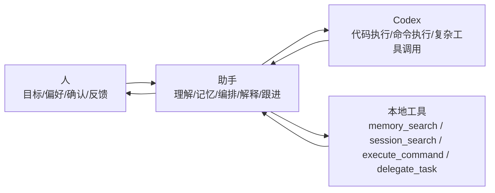

# Agent 助手与 Codex 职责边界方案

> 状态：active  
> 角色：明确“人 / 助手 / Codex”三层协作边界，防止产品定位漂移  
> 上位约束：`docs/00_规范/00-项目愿景与产品规划.md`、`docs/00_规范/03-文档执行闭环规范.md`  
> 关联方案：`docs/10_方案/10-架构升级设计方案.md`、`docs/10_方案/11-记忆系统规划方案.md`

---

## 一、文档定位

本文件回答四件事：

1. 这个项目与 `Codex` 的关系是什么。
2. 人、助手、`Codex` 各自负责什么，不负责什么。
3. 助手在什么场景应自己处理，什么场景应委派给 `Codex`，什么场景必须让人确认。
4. 后续能力建设的优先级应该围绕什么展开。

本文件不是：

1. `Codex` 替代方案。
2. 单纯的产品宣传文案。
3. 具体工具协议实现细节文档。

---

## 二、核心定位（唯一口径）

这个项目**不应替代 `Codex`**，而应做成：

- 人提出目标、偏好、约束和真实意图。
- 助手理解人、记住人、持续跟进人，并负责任务编排与结果承接。
- `Codex` 作为高执行力外脑 / 专业工具，被助手按需调用。

一句话定义：

> **TmAgent 是“会记住人、会理解人、会调度 Codex、会把结果接住”的 Agent 助手层；Codex 是其执行内核之一，而不是竞品。**

---

## 三、职责边界图

---

## 四、三层职责分工

### 4.1 人负责什么

人负责：

1. 提出目标，而不是给出机器级执行细节。
2. 提供偏好、边界、风险容忍度与最终确认。
3. 对“是否继续”“是否接受风险”“是否授权执行”做决策。

人不负责：

1. 亲自管理工具调用顺序。
2. 手动维护长期上下文。
3. 盯每一个后台步骤和中间状态。

### 4.2 助手负责什么

助手负责：

1. **理解**：理解用户真实意图、上下文、偏好与约束。
2. **记忆**：沉淀用户画像、长期偏好、项目上下文和历史决策。
3. **编排**：判断应直接回答、调用本地工具、还是委派给 `Codex`。
4. **跟进**：维护任务状态，知道做到哪一步、下一步是什么、失败在哪里。
5. **解释**：把执行结果翻译成用户能理解的语言、风险、建议和待确认项。
6. **承接**：把 `Codex` 或本地工具的结果写回记忆、会话、状态和计划。

助手不负责：

1. 盲目替代 `Codex` 做所有复杂执行。
2. 在高风险场景下绕开用户确认。
3. 把底层执行细节原样甩给用户而不做转译。

### 4.3 Codex 负责什么

`Codex` 负责：

1. 高执行力代码修改与工程操作。
2. 长工具链任务执行（命令、补丁、测试、编译、协议化工具）。
3. 在明确目标和边界下完成较复杂的技术动作。

`Codex` 不负责：

1. 长期记住用户是谁、喜欢什么、长期在推进什么。
2. 替用户做产品意图澄清与关系维护。
3. 作为“陪跑者”持续承接非结构化上下文。

---

## 五、助手的决策顺序

助手面对任务时，优先按下面顺序决策：

1. **先判断是否可以直接回答**
   - 用户问的是方案、解释、建议、风险判断时，优先直接回答，不急着执行。
2. **再判断是否可用本地能力闭环**
   - 记忆检索、会话检索、简单文件读写、本地轻量命令，可优先由助手自己的工具链完成。
3. **再判断是否应委派给 `Codex`**
   - 涉及复杂代码修改、长链执行、跨文件重构、工程构建/测试、复杂协议调用时，优先委派给 `Codex`。
4. **最后判断是否必须让人确认**
   - 涉及风险、破坏性操作、权限扩张、方向切换时，必须回到人来决策。

---

## 六、何时应该委派给 Codex

出现以下情况时，助手应优先考虑委派给 `Codex`：

1. 需要大规模改代码、改多个文件、跑构建/测试。
2. 需要长时间执行且中间状态较多。
3. 需要高精度工具调用与复杂命令编排。
4. 需要比当前助手更强的工程执行稳定性与恢复能力。

不应委派给 `Codex` 的情况：

1. 只是理解用户意图、总结、解释、规划。
2. 只是读取记忆、整理会话、确认偏好。
3. 明显需要人先确认方向，而不是先执行。

---

## 七、助手最该向 Codex 学的能力

这个系统不该去学“成为另一个 `Codex`”，而该优先学这四种能力：

### 7.1 任务执行编排能力（第一优先）

重点是：

1. 什么时候拆任务。
2. 什么时候调本地工具。
3. 什么时候委派给 `Codex`。
4. 什么时候停下来先给用户方案。

本质上，助手不是“做完一切的人”，而是“决定谁来做什么的人”。

### 7.2 可恢复的执行状态（第二优先）

重点是：

1. 明确任务处于什么状态：未开始 / 执行中 / 已完成 / 已失败 / 已取消。
2. 记录做到哪一步、依赖什么结果、下一步是什么。
3. 在中断、重启、切换会话后还能继续承接。

这是桥梁系统最重要的能力之一，因为桥梁最怕断线。

### 7.3 权限确认与边界管理（第三优先）

重点是：

1. 哪些事情助手可直接做。
2. 哪些事情应交给 `Codex`。
3. 哪些事情必须用户确认。
4. 哪些结果必须显式回报用户。

这不是附属安全能力，而是桥梁角色的核心礼仪。

### 7.4 结果转译与记忆沉淀（第四优先）

重点是：

1. 把 `Codex` 的执行结果转成用户听得懂的话。
2. 给出下一步建议，而不是只给原始日志。
3. 标注风险、影响和待确认项。
4. 将重要结论沉淀到记忆与后续计划中。

这部分恰恰是 `Codex` 相对不擅长、而本项目最有产品价值的地方。

---

## 八、当前能力建设优先级

按本项目当前状态，后续能力建设应优先围绕以下顺序展开：

1. **任务状态机与执行编排**
2. **Codex 调用协议与结果承接**
3. **权限确认与边界管理**
4. **记忆驱动的持续跟进**
5. **更强的执行能力增强（如真实 embedding、插件、更多工具）**

说明：

1. 不先把“桥梁层”做稳，就不该盲目扩张“执行器能力”。
2. 助手层的价值首先来自理解、记忆、编排和承接，而不是比 `Codex` 更会写代码。

---

## 九、验收标准

当这个定位真正落地时，应该能满足以下验收点：

### 9.1 角色边界验收

1. 助手不会把所有复杂技术动作都自己硬做。
2. 助手能明确说明“这件事我自己做 / 我委派给 Codex / 需要你确认”的原因。
3. 用户不会把助手和 `Codex` 的职责混为一谈。

### 9.2 流程体验验收

1. 用户给出目标后，助手先做意图澄清和编排，而不是直接乱执行。
2. `Codex` 返回结果后，助手能给出清晰解释、风险和下一步。
3. 中途中断后，助手还能接着说清当前状态与恢复点。

### 9.3 记忆承接验收

1. 用户偏好、任务目标、关键决策能进入记忆，而不是只存在当前上下文。
2. `Codex` 的关键输出能够被助手抽取并沉淀，不丢在原始日志里。

---

## 十、落地要求

从本文件生效起，后续涉及 Agent 能力设计时，必须遵守：

1. 新能力先判断它是在强化“助手层”还是在复制“Codex 层”。
2. 如果某功能更像执行引擎能力，优先考虑“如何调度 `Codex`”，而不是在本项目中重复实现一套。
3. 所有与执行相关的设计，都要回答：
   - 这一步由谁负责？
   - 人何时介入？
   - 助手如何承接结果？
   - 记忆如何沉淀？

---

*文档版本：v1.0*  
*创建日期：2026-03-12*  
*关联文档：docs/10_方案/10-架构升级设计方案.md、docs/10_方案/11-记忆系统规划方案.md、docs/30_执行/30-当前执行主线.md*
